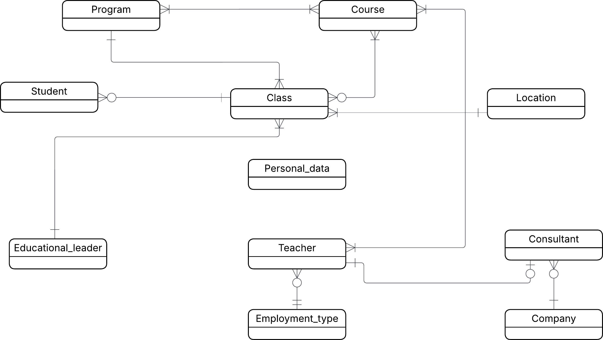

# Conceptual models

**Conceptual ERD**

**Relationship statements**

**Student-Class**
- A Student must belong to *one* Class
- A Class may have *zero or many* Students

**Class-Program**
- Every Class belongs to *one* Program
- A Program always have *one or many* Classes

**Program-Course**
- A Program may have *one or many * Courses
- A course may belong to *one or many* Programs
